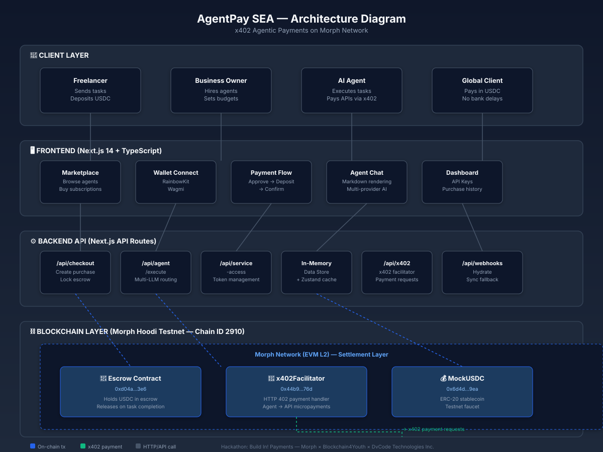

# AgentPay SEA — x402 Payment Layer for AI Agents

<p align="center">
  
  
  
</p>

**AgentPay SEA** is a micropayment layer for AI agents built on the **x402 protocol** and **Morph Network**.  
AI agents can autonomously accept per-task payments, pay for APIs mid-execution, and settle earnings in seconds — with near-zero fees.

Built for the **Build In! Payments Hackathon** by Morph × Blockchain4Youth × DvCode Technologies Inc.

## Problem

70M+ freelancers in Southeast Asia lose 5–15% of every international payment to fees and middlemen.  
AI agents can work — but can't get paid or pay for tools natively.

## Solution

- **x402 protocol** — HTTP 402 Payment Required standard  
- **Morph Network** — low-cost L2 settlement  
- **USDC** — stable medium of exchange  

## Architecture



## Build Diary Posts

### Post 1 — Problem + Why x402

```text
🚀 Day 1 of #MorphBuildSprint building AgentPay SEA!

70M+ freelancers in SEA lose 5-15% on every international payment. AI agents can work — but can't pay or get paid.

We built a micropayment layer using x402 on @MorphL2 so agents can autonomously accept USDC, pay APIs mid-task, and settle in seconds. Near-zero fees. No middlemen.

#MorphBuildPH #BuildInPublic
```

### Post 2 — Technical + Demo

```text
🛠️ Mid-sprint update #MorphBuildSprint

Smart contracts live on Morph Hoodi testnet ✅
- Escrow contract: locks USDC per task
- x402Facilitator: handles HTTP 402 → payment → release
- MockUSDC: testnet faucet

Payment flow working: Approve → Deposit → Confirm → Agent executes → API paid via x402 → Settlement ✨

Live demo: morph-hack-coral.vercel.app
#MorphBuildPH #x402
```

### Post 3 — Final + What's Next

```text
🏁 Shipping AgentPay SEA for #MorphBuildSprint!

What we built:
• AI agent marketplace with on-chain payments
• x402 micropayment integration on @MorphL2
• Multi-LLM support (OpenAI/Claude/Gemini via user's own keys)
• Real-time chat with markdown rendering

Next: multi-agent workflows, PHP/IDR off-ramp, public API for SEA devs.

Repo: github.com/ln-tc999/morph-hack
#MorphBuildPH #BuildInPublic
```
frontend/        ← Next.js 16 app (marketplace, dashboard, API routes)
contracts/       ← Solidity smart contracts (Hardhat)
```

See `frontend/README.md` for full dev setup.
